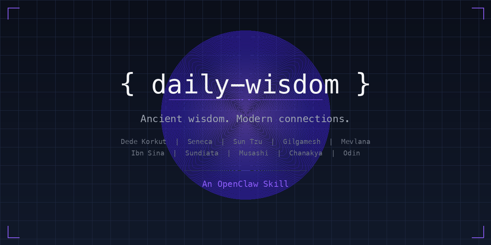

# 📜 Daily Wisdom



> Your AI agent generates a unique historical anecdote every morning — from 100+ sources across 7 civilizations. Never the same story twice.

An [OpenClaw](https://github.com/openclaw/openclaw) skill that turns your AI agent into a cultural historian. Every day it **generates a completely new story** from a pool of 100+ historical figures, epics, and philosophical traditions — Turkic epics, Stoic philosophy, Islamic golden age, Far Eastern strategy, African empires, ancient mythology, and more. Each story includes an original-language quote, a vivid narrative, and a surprising modern connection. A history file ensures **zero repeats** across months.

## ✨ Features

- **🤖 AI-generated, not static** — Your agent creates a brand new story every day from a pool of 100+ sources. Not a database of pre-written posts.
- **🌍 7 civilizations** — Turkic, Islamic, Classical, Far East, African, Norse, Ancient — all drawn equally
- **🔄 Infinite variety, zero repeats** — History file tracking + massive source pool = months of unique content
- **💡 Modern connections** — Every story links to startups, tech, leadership, or daily life
- **📝 Original language quotes** — Göktürk, Latin, Arabic, Japanese, Ancient Greek, Persian, Mandinka
- **🎭 Multiple formats** — Standard, thread, "this day in history", minimal/koan
- **📱 Multi-channel** — WhatsApp, Telegram, Slack, Discord — anywhere OpenClaw delivers

## 📦 Example Output

```
📜 Nasreddin Hoca — Anadolu Halk Geleneği, ~13. yy

> "Ya tutarsa?"
> — Nasreddin Hoca, göle yoğurt çalarken

Hikaye: Bir gün komşusu Hoca'yı gölün kenarında görür.
Hoca bir kaşık yoğurdu göle karıştırmaktadır. "Hoca ne
yapıyorsun?" "Göle yoğurt çalıyorum." "Göl yoğurt olur
mu hiç?" Hoca cevap verir: "Ya tutarsa?"...

💡 Modern Bağlantı: "Ya tutarsa?" — dünyanın en kısa
lean startup manifesti. Airbnb: "İnsanlar yabancıların
evinde kalır mı? Ya tutarsa." Bitcoin: "Para devletsiz
olur mu? Ya tutarsa."...
```

The skill **generates new stories daily** — these are just samples of what it produces. See all 17 example outputs in [`examples/`](./examples/).

## 🚀 Quick Start

### 1. Install the skill
Copy this directory into your OpenClaw workspace:
```bash
cd ~/your-openclaw-workspace
git clone https://github.com/AytuncYildizli/daily-wisdom.git skills/daily-wisdom
```

### 2. Create history file
```bash
cp skills/daily-wisdom/history.md memory/anecdote-history.md
```

### 3. Set up the cron job
In your OpenClaw session, ask your agent:
```
Set up a daily wisdom cron job at 07:30 my timezone using the 
daily-wisdom skill. Deliver to my main chat.
```

Or configure manually — see [SKILL.md](./SKILL.md) for the full cron configuration.

## 📂 Structure

```
daily-wisdom/
├── README.md          ← You are here
├── SKILL.md           ← OpenClaw skill definition + prompt templates
├── history.md         ← Repeat-prevention tracker (template)
└── examples/
    │
    ├── ── Turkic & Central Asian ──
    ├── turkic-kan-turali.md         ← Warrior couple vs 3 beasts
    ├── turkic-basat-tepegoz.md      ← Turkish Polyphemus
    ├── turkic-deli-dumrul.md        ← Death vs Love  
    ├── turkic-orhon.md              ← Bilge Kağan's stone inscription
    ├── turkic-nasreddin.md          ← "Ya tutarsa?" — world's shortest startup manifesto
    │
    ├── ── Mythology (cross-civilization) ──
    ├── mythology-gilgamesh.md       ← Oldest story, first pivot
    ├── mythology-prometheus.md      ← Fire thief — every whistleblower's ancestor
    ├── mythology-ragnarok.md        ← Gods who knew they'd lose and fought anyway
    ├── mythology-anansi.md          ← Spider who bought all stories (first hacker)
    ├── mythology-maui.md            ← Trickster who lassoed the sun (Polynesia)
    │
    ├── ── Classical & Islamic ──
    ├── classical-seneca.md          ← Time is the only non-renewable
    ├── classical-marcus-aurelius.md ← Obstacle is the way (the original)
    ├── islamic-ibn-sina.md          ← First biofeedback experiment
    ├── sufi-mevlana.md              ← The wound is where light enters
    │
    ├── ── Far East, African, Indian ──
    ├── fareast-musashi.md           ← Sword from an oar
    ├── african-sundiata.md          ← Crippled boy who built an empire
    ├── indian-chanakya.md           ← Kingmaker's 2000-year-lost playbook
    ├── norse-havamal.md             ← Odin's price for wisdom
    │
    ├── ── Alternative Formats ──
    ├── format-thread.md             ← Twitter/X thread (Mansa Musa)
    ├── format-thisday.md            ← "This Day in History" (Galileo)
    └── zen-gateless-gate.md         ← Minimal koan — no modern connection
```

## 🎯 Source Pool

All traditions drawn equally — no fixed percentages. Maximum variety, no back-to-back repeats from the same tradition.

| Region | Key Sources |
|--------|-------------|
| **Turkic & Central Asian** | Dede Korkut, Orhon Yazıtları, Manas, Nasreddin Hoca, Mete Han, Attila |
| **Islamic Golden Age & Sufi** | Ibn Sina, Al-Khwarizmi, Mevlana, Yunus Emre, Ibn Battuta, Ibn Khaldun |
| **Classical Mediterranean** | Seneca, Marcus Aurelius, Epictetus, Heraclitus, Diogenes, Plutarch |
| **Far East** | Sun Tzu, Musashi, Confucius, Laozi, Chanakya, Zen koans |
| **Ancient & Pre-Classical** | Gilgamesh, Egyptian (Ptahhotep), Norse (Hávamál), Sumerian, Zoroastrian |
| **African & Indigenous** | Sundiata Keita, Mansa Musa, Anansi, Ubuntu, Timbuktu scholars |
| **Renaissance & Modern** | Machiavelli, Montaigne, Leonardo, Ada Lovelace, Tesla |

## ⚙️ Customization

### Adjust source weights
In the cron prompt, change the instruction:
```
MANDATORY: 80% Turkic/Islamic sources. Max 1 in 5 from other pools.
```

### Change language
```
# Full English
Write entirely in English. Translate all quotes to English.

# Full Turkish  
Tamamını Türkçe yaz. Alıntıları hem orijinal dilde hem Türkçe ver.
```

### Weekend deep dives
Add a second cron with the Deep Dive variant (10-15 sentences, 2-3 quotes, multiple modern parallels). See SKILL.md for the template.

### Multiple daily sends
- Morning (07:30): Standard wisdom
- Evening (21:00): Reflection prompt variant

## 🧪 Quality Philosophy

1. **Specificity > generality**: "In 735, on a stone in the Orhon Valley..." beats "The Turks once wrote..."
2. **Original language = magic**: Even unreadable scripts create emotional impact
3. **Modern connections must surprise**: Not "this is relevant" but *how* it's relevant
4. **Vary the emotional register**: Profound → funny → dark → inspiring → tactical
5. **The best stories contain paradox**: Seneca writing about moderation from Nero's palace

## 🤝 Contributing

Add new example outputs to `examples/`. The naming convention:
```
{region}-{subject}.md
```

Regions: `turkic`, `classical`, `fareast`, `mythology`, `islamic`, `sufi`, `norse`, `renaissance`

PRs welcome for:
- New source traditions (African, Mesoamerican, Indian, etc.)
- Better modern connections
- Translations of prompt templates
- Additional delivery format variants

## 📄 License

MIT — use it, fork it, make it yours.

---

*Built for [OpenClaw](https://github.com/openclaw/openclaw) 🐾 • Find more skills at [ClawHub](https://clawhub.com)*
